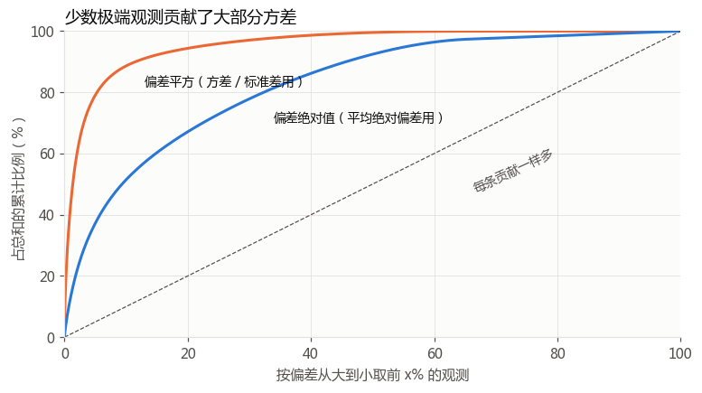
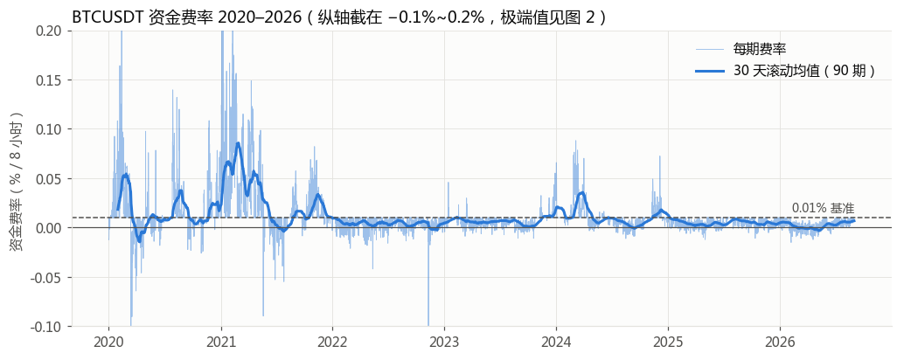
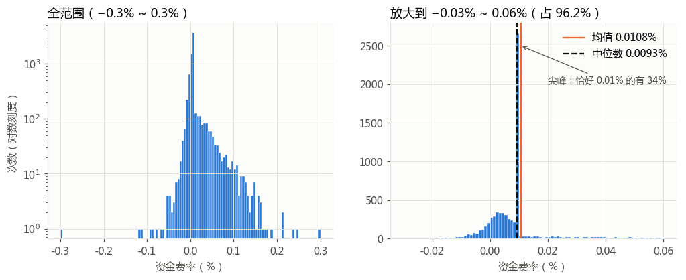
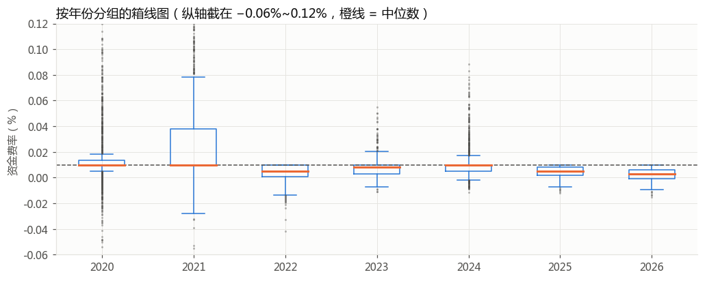
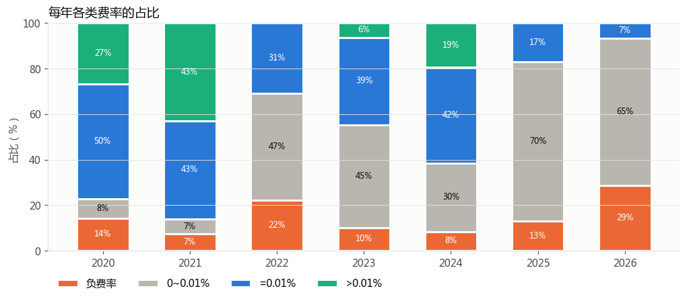
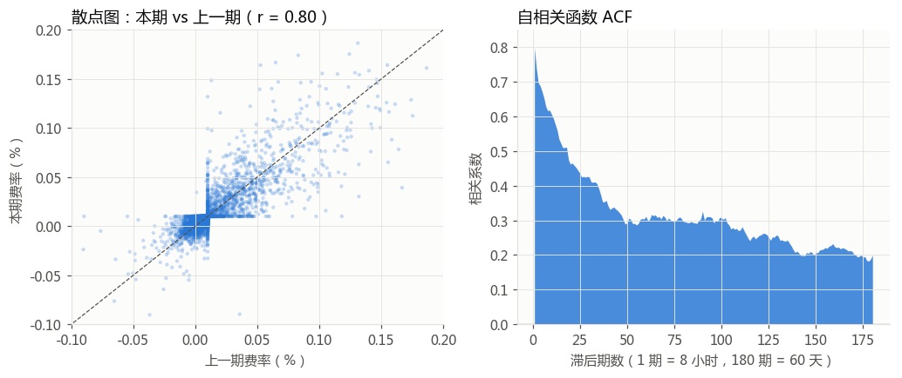

# 第 1 步：认识数据 —— BTCUSDT 永续资金费率

> 对应笔记「第 1 章 探索性数据分析 EDA」。代码：[01_eda_btcusdt.py](01_eda_btcusdt.py)，运行后会重新生成下面所有数字和图。
> 数据：币安 data.binance.vision，2020-01-01 ~ 2026-08-31，共 7305 期。

**单位约定**：原始值是小数，`0.0001` = **0.01%**。下文统一用 “% / 8 小时”（每 8 小时结算一次）。
年化 ≈ 每期费率 × 3 × 365，所以 0.01% / 8h ≈ 年化 10.95%。

---

## 1.1 / 1.2 数据长什么样

| 列 | 含义 | 数据类型（笔记 1.1） |
|---|---|---|
| `calc_time` | 结算时间，毫秒时间戳 | 时间（记录的索引） |
| `funding_interval_hours` | 结算间隔（小时） | 离散型，但这里**只有一个值 8**，没有信息量 |
| `last_funding_rate` | 该期资金费率 | **连续型**，是我们要研究的变量 |

- 一行 = 一次结算（记录），7305 行。
- 数据质量：相邻两条**全部**正好相隔 8 小时，没有缺失，也没有重复。时间戳偶尔有 1~11 毫秒的抖动，已经取整到分钟。

## 1.3 位置：费率的“中心”在哪

| 统计量 | 值 |
|---|---|
| 均值 | 0.01077% |
| 中位数 | 0.00928% |
| 10% 截尾均值 | 0.00726% |
| **众数** | **0.01000%（占全部 34%）** |

**解读**
- **均值 > 中位数 > 截尾均值**，说明数据**右偏**：少数很高的正费率（牛市狂热期）把均值往上拉了。去掉两头各 10% 以后，截尾均值只有 0.0073%。
- 众数正好是 0.01%，而且占了三分之一。这不是巧合，而是币安的计算规则造成的：资金费率 = 溢价指数 + clamp(利率 0.01% − 溢价指数, ±0.05%)。只要合约价格和现货价格差得不多，clamp 这一项就会把结果“吸”到 0.01%。
- 按均值算，长期持有多头每年要付约 **11.8%**，但各年份差别很大（见 1.8）。

## 1.4 变异性：有多分散

位置估计回答“中心在哪”，变异性估计回答**“数据离中心有多远”**。同样是平均 0.01%，一种情况是每期都在 0.009%~0.011% 之间，另一种是在 −0.1%~+0.1% 之间来回跳，这两种对交易者来说是完全不同的风险。

### 五个指标分别怎么算

设有 n 个费率 x₁…xₙ，均值为 x̄，中位数为 m。

| 指标 | 计算方法 | 一句话含义 | 本数据的值 |
|---|---|---|---|
| **标准差** | 先算方差 = Σ(xᵢ − x̄)² / (n−1)，再开根号 | 偏差**先平方**、再平均、再开方 | 0.0210% |
| **平均绝对偏差** | Σ\|xᵢ − x̄\| / n | 偏差取**绝对值**后平均 | 0.0100% |
| **MAD** | 中位数( \|xᵢ − m\| ) | 离中位数距离的**中位数** | 0.0040% |
| **IQR** | P75 − P25 | 中间 50% 数据覆盖的宽度 | 0.0073% |
| **极差** | 最大值 − 最小值 | 只看两个最极端的点 | 0.60% |

分位数一览：

| P1 | P5 | P25 | P50 | P75 | P95 | P99 |
|---|---|---|---|---|---|---|
| −0.0169% | −0.0052% | 0.0027% | 0.0093% | 0.0100% | 0.0469% | 0.1062% |

同一份数据，五个指标给出的“分散程度”从 0.004% 到 0.6% 不等，相差 150 倍。原因不是算错了，而是**它们对极端值的反应不一样**。

### 为什么标准差“敏感”：三个原因

**原因 1：平方会放大大的偏差**

标准差的第一步是把每个偏差**平方**。平方对小数和大数的作用很不一样：

| 偏差 | 绝对值 | 平方 |
|---|---|---|
| 普通的一期：偏离 0.002% | 0.002 | 0.000004 |
| 极端的一期：偏离 0.2% | 0.2 | 0.04 |
| 极端 ÷ 普通 | **100 倍** | **10000 倍** |

按绝对值算，一个极端值只相当于 100 个普通值；平方以后，它相当于 **10000 个**普通值。所以在方差的加总里，少数大偏差几乎决定了结果。

用本数据实际算一下（实验 B）：

| 按偏差从大到小取 | 占全部观测 | 占偏差**平方**和（方差用） | 占偏差**绝对值**和 |
|---|---|---|---|
| 最大的 2 条 | 0.03% | 5.6% | 0.8% |
| 最大的 10 条 | 0.1% | 14.9% | 2.9% |
| 最大的 73 条 | 1% | **43.4%** | 13.2% |
| 最大的 365 条 | 5% | **79.1%** | 37.2% |

**只占 1% 的 73 条极端观测，贡献了方差的 43%**；5% 的观测贡献了 79%。换句话说，标准差这个数主要是由牛市里那几百期高费率决定的，另外 95% 的“平常日子”对它影响很小。

图里的虚线表示“每条观测贡献一样多”。橙线（平方）一开始就冲到 90% 附近，说明方差被少数观测主导；蓝线（绝对值）也偏离了虚线，但温和得多。这就是为什么平均绝对偏差也算“较敏感”，但没有标准差那么夸张。

**原因 2：连“中心”本身也被拉偏了**

标准差是以**均值**为中心来量距离的，而均值本身就对极端值敏感（1.3 节：均值 0.0108% > 中位数 0.0093%）。所以这里是两层放大：极端值先把中心拉偏，再通过平方把距离放大。MAD 以中位数为中心，再取中位数，这两层都不受极端值影响。

**原因 3：崩溃点（breakdown point）不同**

这是衡量稳健性的正式概念：**至少要改多少比例的数据，才能让这个指标变成任意大？**

| 指标 | 崩溃点 | 含义 |
|---|---|---|
| 标准差、平均绝对偏差、极差 | 0% | 只要把**一个**值改成无穷大，结果就变成无穷大 |
| IQR | 25% | 要污染超过四分之一的数据才能把它推走 |
| MAD | 50% | 要污染一半以上的数据才行，是理论上最稳健的 |

### 动手验证：去掉或加入极端值（实验 A）

| 操作 | 标准差 | 平均绝对偏差 | MAD | IQR | 极差 |
|---|---|---|---|---|---|
| 全部数据 | 0.0210% | 0.0100% | 0.0040% | 0.0073% | 0.600% |
| 去掉两头共 0.1%（8 条） | **−6%** | −2% | 0% | 0% | −50% |
| 去掉两头共 1%（74 条） | **−19%** | −13% | −2% | −1% | −75% |
| 去掉两头共 5%（366 条） | **−45%** | −35% | −14% | −4% | −87% |
| 额外加入 1 个 1.0% | **+14%** | +2% | 0% | 0% | +117% |

- 只去掉 8 条数据（千分之一），标准差就降了 6%，而 MAD 和 IQR 纹丝不动。
- 只**加 1 条**数据（7305 条里多 1 条），标准差就涨了 14%。
- 极差最夸张，因为它只由 2 个点决定。
- 排序大致是：**极差 > 标准差 > 平均绝对偏差 > MAD ≈ IQR**（越往右越稳健）。

### “敏感”会带来什么实际问题

**问题 1：标准差对“平常日子”描述得不准**

按照正态分布的经验，“均值 ± 1 个标准差”应该覆盖约 68% 的数据。但在本数据中，0.0108% ± 0.0210% 这个区间覆盖了 **90%** 的数据。也就是说，对大部分时间来说，标准差把波动**说大了**。

MAD 可以换算成和标准差可比的数（正态分布下，标准差 ≈ 1.4826 × MAD）：1.4826 × 0.0040% ≈ **0.0059%**。这个数大约才是“平常日子”的真实波动，只有标准差的 28%。

**问题 2：但标准差对极端情况又说小了**

如果按正态分布理解，“超过均值 5 个标准差”（即 > 0.116%）几乎不可能发生（约 350 万分之一，7305 期里期望出现 0.002 次）。但本数据里实际出现了 **56 次**。这就是 1.5 节讲的“厚尾”。

所以对这类数据，**一个标准差同时犯了两种错**：日常波动说大了，极端风险又说小了。它想用一个数去概括“一大堆很平静的日子 + 少数疯狂的日子”，结果两边都不像。

### 那还要不要用标准差？

要用，但要**知道它在衡量什么**：

- **想知道“平常日子”的波动** → 用 MAD、IQR、分位数。
- **关心总成本或总风险** → 标准差和方差恰恰是对的。例如，持仓一年的资金费用由所有期**加总**决定，那几十次极端高费率就是真实成本，不应该被当成“噪音”剔除掉。方差对极端值敏感，在这种场景下正好是优点。
- **后面的统计方法大量基于方差**（第 2 章的标准误、第 4 章的回归）。所以现在就要记住：本数据的方差由少数观测主导，那些方法的结果会比较“不稳”。
- **最好的做法**是两类都报告，再加上分位数，并在报告里写清楚它们为什么差这么多。一个数永远概括不了一个厚尾分布。

### 其他观察

- P75 刚好是 0.01%，说明 **75% 的时间费率 ≤ 0.01%**。IQR 这么小（0.0073%），也是因为大量数据挤在 0.01% 这一个点上。
- 最大值和最小值都**恰好**等于 ±0.3%（2020-02-12 和 2020-03-13 的“312 暴跌”），说明撞到了当时的费率上下限，也就是被**截断**了，真实的供需失衡可能更极端。这也意味着极差这个指标在这里受交易所规则限制，而不仅仅反映市场本身。

## 1.5 分布

- 偏度 3.37（明显右偏），超额峰度 31.7（**非常厚的尾巴**；正态分布的超额峰度是 0）。
- **怎么从图上看出“右偏”**：正态分布左右对称，偏度 = 0，以峰为中心把图对折，两边能重合。右偏就是**右边的尾巴比左边长、比左边厚**，折过去对不上。在这张图里有三个地方可以看：
  1. **左图（全范围）**：以 0.01% 附近的峰为中心，左边的柱子到 −0.05% 左右就基本没了，右边却一路延伸到 0.2% 以上，而且高度下降得慢（在对数刻度上是一条缓坡）。左边只零星散着几根孤立的柱子（−0.3%、−0.1% 附近），数量很少。
  2. **数一下两边的尾巴**：以中位数为中心，高出中位数 0.05% 以上的有 252 期，低于中位数 0.05% 以上的只有 18 期；距离放到 0.1% 时，两边分别是 64 期和 3 期。
  3. **右图（放大）**：橙色的均值线在黑色虚线（中位数）的**右边**。均值会被长尾“拽”过去，中位数不会，所以**均值 > 中位数**就是右偏最直接的信号（左偏则反过来，均值 < 中位数）。
  - 口诀：**偏向哪边，看长尾巴在哪边**，而不是看峰在哪边。右偏分布的峰其实偏左，长尾在右。
- 直方图的形状是 **“一根尖针 + 一座小山 + 右边一条长尾”**：
  - 尖针：恰好 0.01% 的那 34%；
  - 小山：0 ~ 0.01% 之间的连续值；
  - 长尾：牛市里 0.05% ~ 0.3% 的高费率。
- 所以这份数据**完全不是正态分布**。以后用到假设正态的方法（t 检验、置信区间公式）要特别小心，这也是第 2、3 章讲 bootstrap 的原因。
- 从时间序列看，高费率集中在 2020 年底到 2021 年的牛市，以及 2024 年初（现货 ETF 获批前后）。2022 年以后整体明显变“安静”。

## 1.6 把费率分成类别

把连续值切成 4 类（这就是把连续型转成**有序类别**）：

| 类别 | 全部占比 |
|---|---|
| 负费率（空头付钱给多头） | 14.1% |
| 0 ~ 0.01% | 37.6% |
| = 0.01%（基准） | 34.0% |
| > 0.01%（多头拥挤） | 14.3% |

## 1.8 两个变量：年份 × 费率

| 年份 | 均值 | 中位数 | 标准差 | IQR | 年化均值 | 负费率占比 | >0.01% 占比 |
|---|---|---|---|---|---|---|---|
| 2020 | 0.0157% | 0.0100% | 0.0280% | 0.0033% | 17.2% | 14.3% | 26.8% |
| 2021 | 0.0280% | 0.0100% | 0.0374% | 0.0277% | **30.6%** | 7.3% | **42.9%** |
| 2022 | 0.0038% | 0.0051% | 0.0082% | 0.0094% | 4.2% | 22.1% | 0% |
| 2023 | 0.0072% | 0.0083% | 0.0068% | 0.0071% | 7.9% | 10.1% | 6.3% |
| 2024 | 0.0109% | 0.0100% | 0.0119% | 0.0048% | 11.9% | 8.4% | 19.4% |
| 2025 | 0.0047% | 0.0048% | 0.0041% | 0.0064% | 5.1% | 12.9% | 0% |
| 2026* | 0.0024% | 0.0028% | 0.0049% | 0.0065% | 2.6% | **28.5%** | 0% |

\* 2026 年只有 1~8 月的数据。

**解读**
- **不同年份的数据不是“同一个分布”**。2021 年的年化是 30%，2026 年只有 2.6%。如果把 7 年混在一起算一个均值（11.8%），它其实哪一年都代表不了。这就是笔记 2.1 “样本能不能代表总体”的问题：关心未来的话，最近几年的数据可能比 2021 年的更有参考价值。
- 2022 年以后，箱子的上边缘基本贴着 0.01%，高于 0.01% 的费率几乎消失了。2025 和 2026 年更是一次都没有，而负费率的占比在上升。这可能和市场结构有关（例如基差交易的资金变多、ETF 分流了现货需求），但目前**只是猜测，EDA 阶段不下因果结论**。

## 1.7 相关性：费率和它自己的过去

| 滞后 | 8 小时前 | 1 天前 | 3 天前 | 1 周前 | 30 天前 |
|---|---|---|---|---|---|
| 相关系数 | 0.80 | 0.70 | 0.62 | 0.47 | 0.33 |

**解读**
- 目前只有一个变量，所以先看**自相关**：本期费率和 N 期前的费率之间的相关系数。
- 0.80 是很强的正相关：**费率有很强的“惯性”**，高费率之后通常还是高费率。而且衰减很慢，一个月后仍有 0.33。
- 散点图里有一个奇怪的 “Z” 字形：在 0.01% 附近有一个水平台阶。这同样是 clamp 规则造成的，说明费率不是一个平滑的连续过程。
- 这对后面的统计推断很重要：**相邻的观测不独立**。第 2 章的标准误、bootstrap 都默认样本是独立的，直接套用会**低估**不确定性。7305 条数据的“有效样本量”其实小得多。

---

## 小结：这份数据的 5 个特点

1. **干净**：8 小时一期，没有缺失，也没有重复。
2. **有“粘性”的众数**：34% 的时间恰好是 0.01%，这是计算规则造成的，不是自然形成的。
3. **右偏 + 厚尾**：均值被牛市拉高，应该优先用中位数、MAD 和分位数来描述。
4. **不平稳**：不同年份差别巨大，2022 年以后整体下移，负费率变多。
5. **强自相关**：观测之间不独立，后面做推断时要考虑这一点。

## 下一步可以做的

- 下载 BTCUSDT 的 K 线（同样在 data.binance.vision），做**费率和价格涨跌、成交量**之间的相关分析（笔记 1.7、1.8）。
- 对比 BTCUSDC、币本位 BTCUSD_PERP 的费率（多组箱线图）。
- 进入第 2 章：用 bootstrap 估计“年化均值”的置信区间。注意要用**块 bootstrap**来处理自相关。
