# 加密货币资金费率交易 —— 第一部分

> **资金费率更便宜的币，收益会更好吗？**
>
> 原文：*Trading Crypto Funding Rates — Part 1*，作者 DIMA（X：@dima_quant）
> 中文译文 + 补充说明。正文为逐句翻译；"补充说明"是译者为方便理解加的注释，不属于原文。图表中的数字若标注"约"，为从图上估读。

---

## 目录

1. 引言
2. 什么是资金费率？
3. 研究范围（选币池）
4. 资金费率有多"粘"？
5. 资金费率能预测收益吗？
6. 平均值是不是由少数几次极端行情造成的？
7. 把资金费率平均更长时间，会有帮助吗？
8. 便宜的币会一直便宜、贵的币会一直贵吗？
9. 资金费率便宜的效果，在强势币里会更好吗？
10. 资金费率的差距更大，包含的信息会更多吗？
11. 这个效果和市值有关吗？
12. 这个整体结果，在不同年份里都成立吗？
13. 最便宜组和最贵组的走势分别是什么样的？
14. 选币池之间的差别是从哪里来的？
15. 最简单的多空规则，扣掉成本后还剩下什么？
16. 我从中得到的结论
17. 讨论或交流
18. 附：全文要点回顾（译者）

---

## 1. 引言

在之前的突破策略研究里，我测试的是价格趋势。这次我想测试资金费率。

思路很简单：做多资金费率比较便宜的币，做空资金费率比较贵的币。如果这种差距能持续下去，收到和付出的资金费应该对我们有利。问题是，我们仍然要承担价格风险。

**把价格涨跌和交易成本都算进去以后，做多资金费率相对便宜的币、做空资金费率相对贵的币，还能赚钱吗？**

和突破策略那篇一样，我想把整个过程都展示出来，包括没成功的部分。第一部分先测试资金费率里有没有有用的信息，然后试一试最简单的交易方式。第二部分再测试：减少交易次数、调整仓位大小，能不能帮我们多留住一些收益。

## 2. 什么是资金费率？

永续合约没有到期日。资金费率就是让多头和空头之间互相付钱，好让合约价格贴近现货价格。

- 资金费率为正：多头付钱给空头。
- 资金费率为负：空头付钱给多头。
- 付款金额按仓位的名义价值计算。

举个例子，一笔 10,000 美元的空单，在一次 +0.10% 的结算中能收到 10 美元。如果价格涨了 2%，这笔空单在价格上亏 200 美元。我们确实收到了资金费，但扣手续费之前还是亏了 190 美元。

我把每个 UTC 日内记录到的资金费率加起来，再取前面几个已经结束的交易日的平均值，然后乘以 365。这样得到一个年化费率，方便比较。各个币的结算间隔不一样，所以我按实际记录到的结算次数来算，而不是默认每天结算三次。

这里的"便宜"指的是**和其他币相比**。一个资金费率为正的币，只要它的费率比其他币低，我们也可以做多它。这和"只做多资金费率为负的币、只做空资金费率为正的币"不是同一个规则。

比如，年化 +10% 的资金费率比 +30% 便宜。但在 +10% 的情况下，多头还是要付资金费，只是付得少一些。便宜不等于白拿钱。

时间安排很简单：只用已经结束的交易日来生成信号，然后衡量信号之后的价格变动和资金费。第二部分我会看看，如果多等一天再交易，结果会怎样。

> **补充说明**
> - **名义价值**：仓位按市价算值多少钱，不是你投入的保证金。

## 3. 研究范围（选币池）

这项研究用的是币安 2023–2025 年的数据。我把已经下架的合约也算了进去，而不是只看今天还活着的币，不过这份数据存档并没有覆盖历史上所有上过线的合约。在存档和原始数据重叠的部分，我做了核对，结果是一致的；但我没法保证每一次结算都被记录下来了。

这些都是历史回测，不是对实盘表现的预测。

第一个测试用的是存档里的全部合约。然后，我用每个月开始之前就已知的市值，把大币和小币分开比较。我们的数据源覆盖全球市值前 200 的币，能完整对应上前 20、前 50 和前 100 这几组；币安上更小的合约可能会有缺失。

用历史上真实存在过的选币池，可以避免只挑那些活下来的币。但它消除不了数据存档本身覆盖不全的问题。

> **补充说明**
> - 只用今天还在交易的币做回测，等于提前知道了哪些币没死，结果会被美化，这叫"幸存者偏差"。
> - "用每个月之前已知的市值"也是同样的道理：不能用未来才知道的信息来分组。

## 4. 资金费率有多"粘"？

先问一个简单的问题：如果今天的资金费率高，明天是不是也往往会保持在高位？

如果在我能收到这笔钱之前它就消失了，那昨天看起来诱人的费率就没多大用处。持续性是第一个要检查的东西，而不是决定交易的最终理由。

我把今天的资金费率和明天的做比较。然后，我用前 3 天的平均值对比后 3 天、前 7 天的平均值对比后 7 天，把这个测试再做一遍。每个"之前"的时间窗口都在"之后"的窗口开始前就结束了。

每个点代表某个币的"之前的资金费率"和"之后的资金费率"这一对数据。从左到右是之前的资金费率，从下到上是之后的资金费率。为了让点看得清楚，我只显示了中间 90% 的数据，但橙色线是用全部有效数据拟合出来的。两个坐标轴用的都是年化费率。

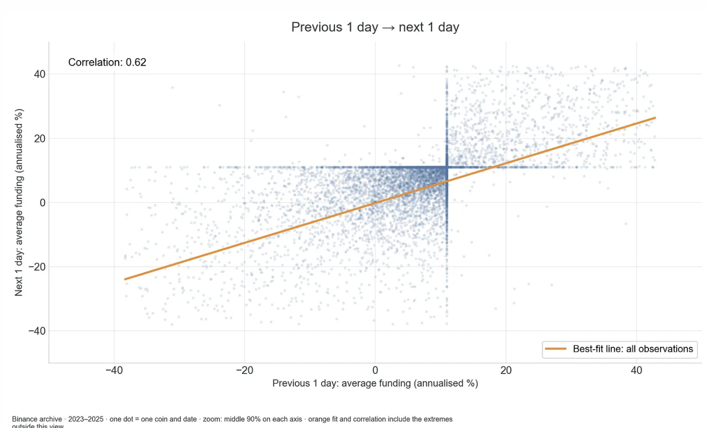

*图：前 1 天 → 后 1 天。相关系数 0.62。横轴：前 1 天平均资金费率（年化 %）；纵轴：后 1 天平均资金费率（年化 %）；橙线：用全部数据拟合的最佳拟合线。注释：币安存档 · 2023–2025 · 每个点 = 一个币在一天的数据 · 每个轴只显示中间 90% · 橙色拟合线和相关系数包含视图之外的极端值。*

资金费率高的币，之后往往也会继续偏高，尤其是从这一天到下一天。这给了我们继续研究下去的理由。但它还不能告诉我们，这笔资金费在扣掉价格涨跌之后还能不能剩下来。

这个结果是不是靠少数几个极端费率撑起来的？把大约最极端的 1% 配对数据去掉以后，三组关系（1 天、3 天、7 天）仍然都是正的。资金费率的这个规律站得住，但我们还需要检验收益。

在把价格变动加进来之前，我先检查一下那些不寻常的资金费。然后再看资金费上的优势到底能剩下多少。

大多数每日费率都在零附近，但有少数几个大得惊人。所以这个平均值值得仔细看一看：

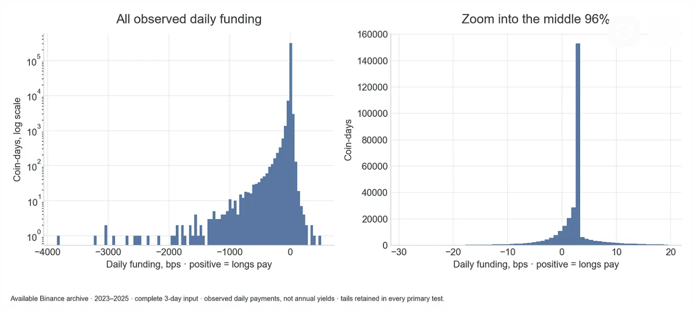

*图：左 —— 所有观测到的每日资金费率（纵轴为对数刻度的"币·天数"）；右 —— 放大看中间 96%。横轴：每日资金费率，单位 bps，正数 = 多头付钱。注释：可用的币安存档 · 2023–2025 · 要求 3 天输入数据完整 · 这里是实际观测到的每日付款，不是年化收益 · 所有主要测试中都保留了极端值。*

单日合计最低的是 MYXUSDT，在 2025 年 8 月 5 日，共记录到 24 次结算，合计 -3845.8 bps（-38.46%）。这一天是空头付钱给多头。这是把费率简单相加的结果，并不是账户赚了 38.46%：每次结算实际付多少钱，取决于那一刻仓位值多少钱。我在主要测试里保留了它，但它说明了为什么这些极端值需要检查。

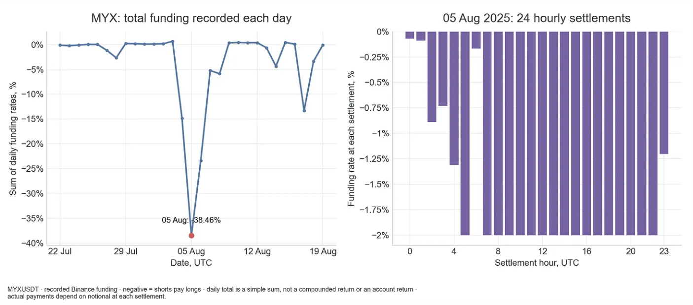

*图：左 —— MYX 每天记录到的资金费率合计（8 月 5 日：-38.46%）；右 —— 2025 年 8 月 5 日的 24 次每小时结算。注释：负数 = 空头付钱给多头 · 每日合计是简单相加，不是复利收益，也不是账户收益 · 实际付款金额取决于每次结算时的名义价值。*

> **补充说明**
> - **相关系数 0.62**：今天高、明天大概率也偏高，但不是完全一样（完全一样是 1，毫无关系是 0）。
> - **散点图里的"十字"**：位置在约 11%。它来自币安的默认资金费率：每 8 小时 0.01%，一天 3 次 = 0.03%，× 365 ≈ 11%。很多币大部分时间就停在这个默认值上。
> - **bps**：1 bp = 0.01%。右侧分布图那根最高的柱子在 +3 bps（每天 0.03%），就是上面说的默认费率。
> - **对数刻度**：纵轴每往上一格，数量乘以 10。这样只出现一两次的极端值也能看见。左图一直拉到 -4000 bps（一天 -40%），这种极端值很少，但出现几次就足以把平均值拉偏。
> - **为什么 MYX 一天结算 24 次**：币安平时一般 8 小时结算一次，行情极端时会把某些币改成每小时结算。
> - **为什么很多柱子停在 -2%**：交易所给每次结算的费率设了上下限，这个币当时的下限是 -2%，市场本来想要更负的费率，被规则卡住了。
> - **为什么不等于账户收益**：比如持有 10,000 美元多单，如果这天币价跌了一半，后面的结算就只按约 5,000 美元算钱。而且这种时候价格剧烈波动，价格上的亏损可能远大于收到的资金费。

## 5. 资金费率能预测收益吗？

现在来看我真正关心的问题：资金费率更便宜的币，等价格变动完之后，是不是能让我剩下更多钱？

每天，我按前 3 天的平均资金费率给币排序，然后分成五组：Q1 最便宜，Q5 最贵。费率相同的币会被分在同一组。

图表把之后 1 天、3 天和 7 天的收益拆成三部分：价格、资金费和合计。这里假设做多并持有固定数量的币；资金费那根柱子是正的，表示我们收到了资金费。我是用每日价格来估算每次付款的金额，而不是用每次结算那一刻的精确价格，这在价格大幅波动时影响最大。

每天之内，每个币的权重相同；然后在求平均时，每一天的权重也相同。我只保留结果完整的数据，而不是把缺失的资金费当成零来处理。好几笔持仓可能经历的是同一段行情，所以它们不算相互独立的交易。

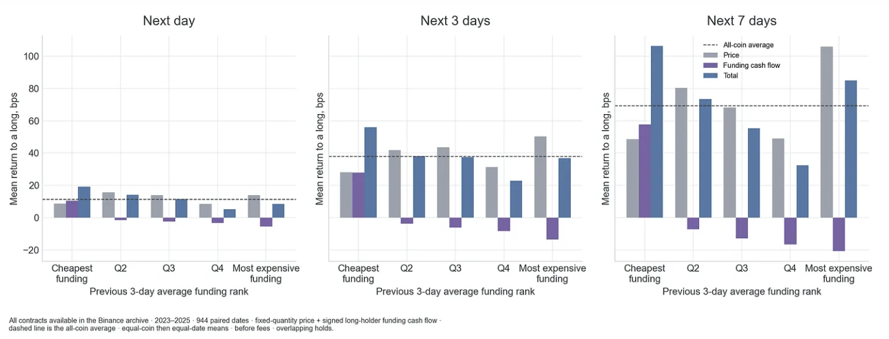

*图：之后 1 天 / 3 天 / 7 天。纵轴：做多的平均收益（bps）；横轴：前 3 天平均资金费率排名（最便宜 → 最贵）。虚线 = 全部币平均值；灰 = 价格；紫 = 资金费现金流；蓝 = 合计。注释：币安存档中所有可用合约 · 2023–2025 · 944 个配对日期 · 固定数量的价格收益 + 多头带正负号的资金费现金流 · 先对币等权、再对日期等权 · 未扣手续费 · 持仓时间有重叠。*

在之后 1 天、3 天和 7 天里，资金费率最便宜的那组币，算上资金费以后，平均总收益都是最高的。它们相对最贵那组的优势，平均分别是 10.7、19.4 和 21.3 bps，这是扣成本之前的数字。这些是组与组之间收益的差，不是一个账户的收益。

但它们的价格涨幅并不是最强的。在 3 天的时间里，资金费让最便宜组领先了 41.5 bps。较弱的价格表现又吐回去 22.2 bps，扣成本前还剩 19.4 bps。

简单的结论是：资金费上的一部分优势，在价格变动之后还留了下来。这让人受到鼓舞，但结果波动很大，而且不确定范围里仍然包含"完全没有优势"这种可能。接下来我会检查不同的时间段、不同的选币池和不同的成本。

> **补充说明**
> - **紫色柱子**：最便宜组是正的（做多还能收钱，这些币常常是负费率），越往右越负（做多要付的钱越多）。资金费这部分完全符合预期。
> - **灰色柱子**：正好反过来。最便宜组价格涨得比较弱，最贵组在 7 天里价格涨得最多。资金费高的币往往是大家看涨、正在涨的币。
> - **两者相抵**：41.5 − 22.2 ≈ 19.4 bps（差一点是四舍五入）。19.4 bps = 0.194%，还没扣手续费和滑点。
> - **"不确定范围仍包含没有优势"**：这个差距在统计上还不够稳，有可能只是运气。

## 6. 平均值是不是由少数几次极端行情造成的？

加密货币的收益有很"肥"的尾巴，也就是极端涨跌出现得比较多。我把"未来价格 + 资金费"这个结果按绝对值排序，去掉最大的 1%，然后把 3 天的测试重做一遍。资金费率的排名不变，两个版本用的也是同样的日期。

在交易之前，我不可能知道明天会出现哪些极端收益。所以这只是对平均值做一次压力测试：如果去掉少数几次大行情以后结果就消失了，那我就应该更谨慎地看待这个结果。

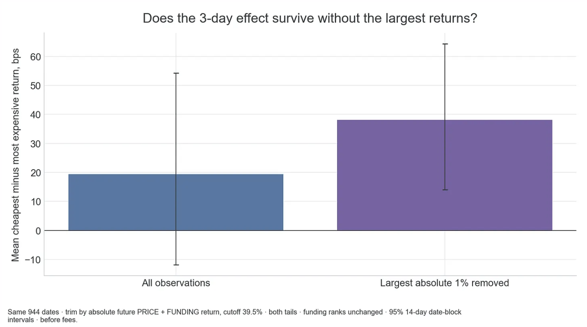

*图：去掉最大的那些收益以后，3 天的效果还在吗？纵轴：最便宜组减最贵组的平均收益（bps）。左：全部数据；右：去掉绝对值最大的 1%。注释：同样的 944 个日期 · 按未来"价格 + 资金费"收益的绝对值剔除，门槛 39.5% · 两头都剔除 · 资金费率排名不变 · 95% 置信区间，按 14 天分块计算 · 未扣手续费。*

去掉最大的 1% 行情以后，平均优势从 19.4 bps 上升到 38.2 bps。所以，并不是少数几次大赚撑起了整个规律。不过，可能结果的范围仍然很宽。

> **补充说明**
> - **误差线**：表示"真实值大概率落在这个范围里"（95% 把握）。左边约 -12 到 +54，跨过了 0；右边约 +14 到 +64，整个在 0 以上。
> - **按 14 天分块**：持仓时间有重叠，相邻几天的数据不独立。按 14 天打包来算，避免把同一段行情重复计算、误以为结果更可靠。
> - **去掉极端值后优势反而变大**：说明极端行情整体上对这个策略不利。比如资金费率很贵的币偶尔会暴涨，做空它就会亏一大笔。这类少见的大行情是这个策略主要的风险来源。

## 7. 把资金费率平均更长时间，会有帮助吗？

只看昨天的资金费率就够了吗，还是取个平均值会更好？我试了 1、2、4、8、16、32 和 64 天。按翻倍来取，既能覆盖反应快的信号，也能覆盖反应慢的信号，又不用把每个可能的天数都试一遍。3 天和 6 天的规则仍然作为原来的对照。

对每一种回看天数，我都比较最便宜的五分之一和最贵的五分之一在之后 1 天和 3 天的表现，包含资金费。在同一个持有期里，所有回看天数用的都是同样的合格日期和币。

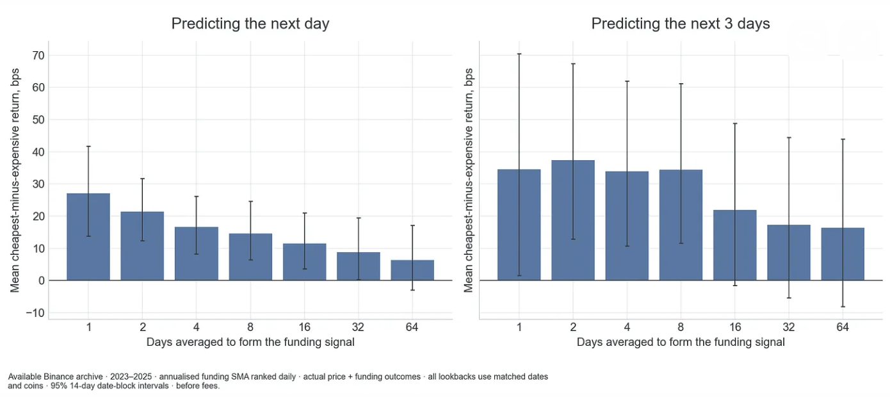

*图：左 —— 预测之后 1 天；右 —— 预测之后 3 天。纵轴：最便宜减最贵的平均收益（bps）；横轴：用来生成资金费率信号的平均天数。注释：可用的币安存档 · 2023–2025 · 每天按年化资金费率简单平均排序 · 实际"价格 + 资金费" · 所有回看天数使用相同日期和币 · 95% 置信区间，按 14 天分块 · 未扣手续费。*

简单的结论：取 1–8 天平均时，便宜组和贵组拉开的差距，比取 32–64 天平均时更明显。对之后几天来说，最近的资金费率看起来更有用，但反应越快，交易成本可能就越高。

> **补充说明**
> - **回看天数**：用过去几天的资金费率来排序。回看 1 天 = 只看昨天；64 天 = 过去两个多月的平均。
> - **左图**：从约 27 bps（1 天）一路降到约 6 bps（64 天）。1–32 天的误差线基本都在 0 以上，只有 64 天跨过了 0。
> - **右图**：1–8 天都在 34–37 bps 左右；16 天以后明显下降，误差线跨过 0。右图误差线整体更长，3 天结果更不稳定。
> - **反应越快、成本越高**：只看昨天的费率，排名每天变化大，要频繁换仓；用更长的平均，换仓少，但信号变弱。这就是第二部分要讨论的取舍。

## 8. 便宜的币会一直便宜、贵的币会一直贵吗？

一个币的资金费率可能一直很高，但同时其他币的费率涨得更高。对这个交易来说，关键是同一批币会不会一直留在便宜组或贵组。我在 1 天、3 天和 6 天之后检查；如果某个币离开了选币池，就算作没有留下。

比较用的是 3 天和 6 天的资金费率平均值，分别在市值前 20、前 50 和前 100 里做。如果排名稳定，我们就可以少交易几次，同时又不用放弃这个信号。

一个币能一直保持便宜，只有在收益足以覆盖价格风险和交易成本时才有用。

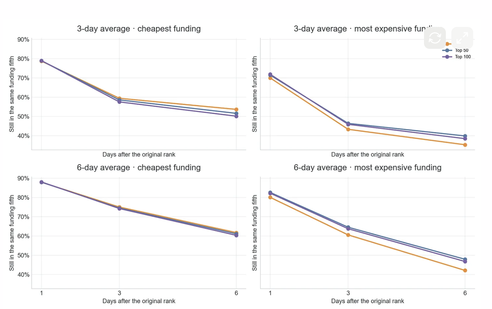

*图：四个小图分别为 3 天平均 · 最便宜 / 3 天平均 · 最贵 / 6 天平均 · 最便宜 / 6 天平均 · 最贵。纵轴：仍留在同一个五分之一组里的比例；横轴：距离最初排名过去的天数。橙 = 前 20（图例被截图按钮遮挡，据正文推断）；蓝 = 前 50；紫 = 前 100。注释：按历史市值划分的前 20/50/100 · 2023–2025 · 在每个选币池内分别排名 · 离开选币池算作没有留下 · 排除最后几个不完整日期 · 仅作描述。*

用 6 天平均时，市值前 20 里资金费率便宜的币，大约 88% 第二天仍然便宜，6 天后还有 62%。前 50 和前 100 的情况差不多。这说明我们可能不需要每天都交易，但收益仍然得能付得起这笔账单。

> **补充说明**
> - 比例越高，排名越稳定，需要换仓的次数越少。
> - **便宜组比贵组更稳**：3 天平均时，6 天后便宜组还留约 50–54%，贵组只剩约 35–40%。资金费率很贵的状态消退得更快，追涨的热度来得快、去得也快。
> - **6 天平均比 3 天平均更稳**：平均天数越长，排名变化越慢。
> - 和上一节合起来看：越近的数据信号越强，越长的平均换仓越少。一边是信号强度，一边是交易成本。

## 9. 资金费率便宜的效果，在强势币里会更好吗？

资金费率便宜，可能只是因为选到了最近下跌的币。为了检查这一点，我按每个币过去 7 天的收益，把它们分成近期赢家、落后者和中间三组。然后在每一组内部，用 6 天资金费率平均值来比较便宜和贵的币。

图表显示的是之后 3 天的收益，包含资金费。"强势"的币也可能还在下跌，它只是比其他币表现好一些。我只保留了九个"资金费率 × 动量"组合全部都有数据的日期，所以这个结果描述的是这个更小的样本。

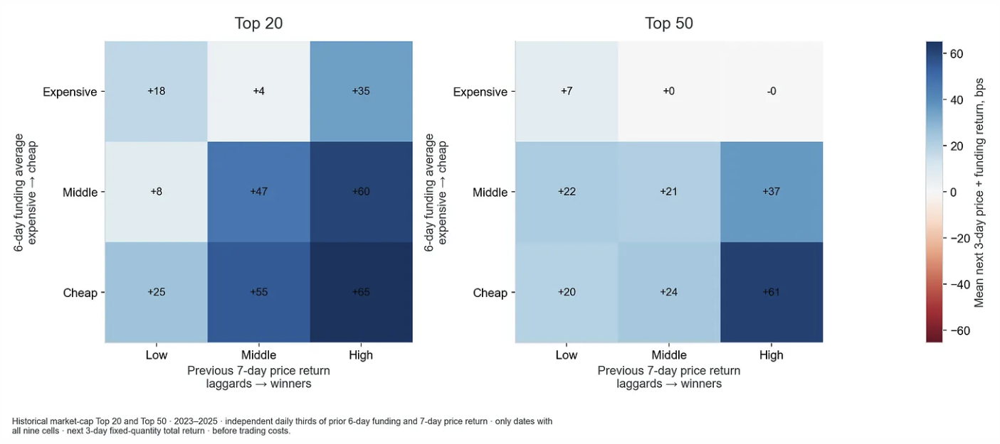

*图：市值前 20 / 前 50。纵轴：6 天资金费率平均（贵 → 便宜）；横轴：过去 7 天价格收益（落后者 → 赢家）；色条：之后 3 天"价格 + 资金费"平均收益（bps）。注释：每天分别按前 6 天资金费率和前 7 天价格收益独立分成三等份 · 只保留九格都有数据的日期 · 固定数量持仓 · 未扣交易成本。*

| 前 20（bps） | 过去 7 天：低 | 中 | 高 |
|---|---|---|---|
| 贵 | +18 | +4 | +35 |
| 中 | +8 | +47 | +60 |
| 便宜 | +25 | +55 | +65 |

| 前 50（bps） | 过去 7 天：低 | 中 | 高 |
|---|---|---|---|
| 贵 | +7 | +0 | -0 |
| 中 | +22 | +21 | +37 |
| 便宜 | +20 | +24 | +61 |

在三个动量组里，资金费率便宜的币都跑赢了资金费率贵的币。平均收益最高的，是资金费率便宜、同时近期价格表现最强的币。这个规律在前 20 和前 50 里都出现了。

简单的结论：资金费率便宜，搭配价格相对强势的时候，看起来最有希望。这是一个值得继续研究的组合，但还不是一个扣除成本后测试过的组合策略。

> **补充说明**
> - **动量**：过去一段时间涨得多还是涨得少，这里用过去 7 天收益衡量。
> - **作者在排除什么**：担心"费率便宜"只是"最近跌了"的另一种说法。先按涨跌分组、再在组内比较，把两件事分开。结果每组里便宜都赢贵，说明资金费率本身有信息。
> - **右下角最深**：前 20 为 +65，前 50 为 +61。一个币最近在涨，但大家没有抢着加杠杆做多（费率不高），这种涨势可能更健康。
> - **前 50 右上角约等于 0**："涨得多又费率贵"的币，通常是过热、多头拥挤的币。
> - 每格样本较少，且没有给误差范围，只能算"值得研究"。

## 10. 资金费率的差距更大，包含的信息会更多吗？

相对排名只能说明谁前谁后，说明不了差多远：年化资金费率 1% 对比 2% 的差距，比 1% 对比 30% 的差距要小。我来测试一下，这个差距能不能告诉我们，什么时候吃资金费这件事更有用。

我把保留下来的日期，按"最贵五分之一"和"最便宜五分之一"之间的年化资金费率差距分组，然后衡量它们之后 3 天的收益差。

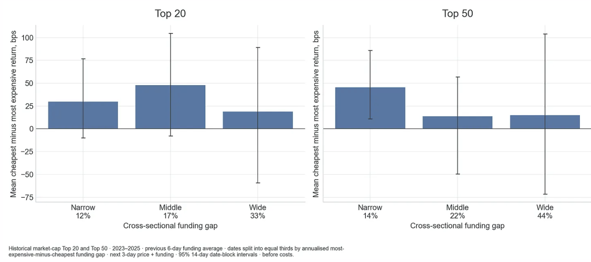

*图：市值前 20 / 前 50。纵轴：最便宜减最贵的平均收益（bps）；横轴：横截面资金费率差距（前 20：窄 12% / 中 17% / 宽 33%；前 50：窄 14% / 中 22% / 宽 44%）。注释：使用前 6 天资金费率平均 · 按"最贵减最便宜"的年化差距把日期平均分成三份 · 之后 3 天"价格 + 资金费" · 95% 置信区间，按 14 天分块 · 未扣成本。*

资金费率差距更大，并不能稳定地带来更大的收益。根据这些证据，我不会因为"差距看起来特别大"就加大交易。柱子下面的百分比描述的是平均年化资金费率差距，不是实盘交易的门槛。大部分不确定区间都包含零。

> **补充说明**
> - **吃资金费（carry）**：靠持仓期间收到或少付的资金费来赚钱。
> - **直觉 vs 结果**：直觉是差距越大收益越高，但前 20 是中间组最高（约 48），前 50 是窄组最高（约 45），没有递增规律。
> - **可能的理解**：差距特别大的日子，往往是某些币被疯狂追涨、费率飙升的时候。做空它收的资金费多，但价格继续暴涨的风险也大。宽差距组误差线最长（前 50 约 -72 到 +104）。
> - 只有前 50 的"窄"组整个在 0 以上。

## 11. 这个效果和市值有关吗？

每个月，我用那个月开始前就已知的市值数据，把能对应上的合约平均分成五个市值组。然后在每个市值组内部，重新对资金费率排序。这是在问：在规模差不多的币里，资金费率便宜的，能不能跑赢资金费率贵的？

这里有两次不同的排序：先按大币和小币分组，然后在每个市值组*内部*比较资金费率便宜和贵的币。资金费率便宜的币，不一定就是小币。

这些市值分组只是在我们能对应上的前 200 范围里划分的，并不包括币安上所有的币。柱子比较的是每组内部便宜和贵的差别。柱子上的竖线表示不确定性：线越长，说明对这个平均值越没有把握。

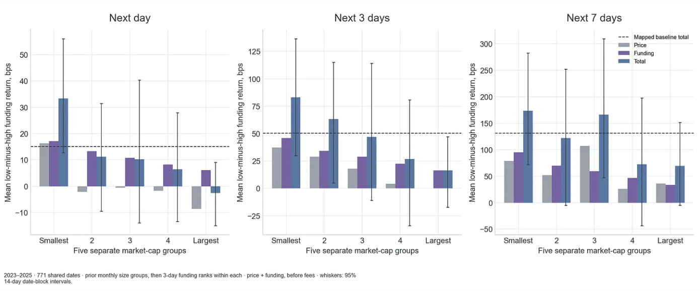

*图：之后 1 天 / 3 天 / 7 天。纵轴：低资金费率减高资金费率的平均收益（bps）；横轴：五个独立的市值组（最小 → 最大）。虚线 = 可对应范围内的基准合计；灰 = 价格；紫 = 资金费；蓝 = 合计。注释：2023–2025 · 771 个共同日期 · 先按上月市值分组，再在组内按 3 天资金费率排序 · 未扣手续费 · 误差线：95% 置信区间，按 14 天分块。*

在每个持有期里，覆盖范围内市值最小的那组币，便宜和贵之间的收益差都是最大的。但误差范围很宽，而且好几组互相重叠。所以小币值得关注，但不代表它自动就更好。小币的交易成本通常也更高。

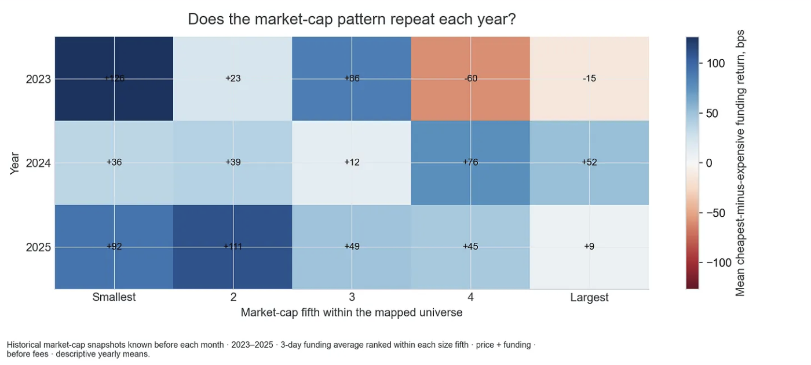

*图：这个市值规律每年都会重复吗？纵轴：年份；横轴：市值五分组（最小 → 最大）；色条：最便宜减最贵的平均收益（bps）。注释：使用每月之前已知的历史市值快照 · 在每个市值组内按 3 天资金费率平均排序 · 价格 + 资金费 · 未扣手续费 · 按年份的描述性平均值。*

| 年份（bps） | 最小 | 2 | 3 | 4 | 最大 |
|---|---|---|---|---|---|
| 2023 | +126 | +23 | +86 | -60 | -15 |
| 2024 | +36 | +39 | +12 | +76 | +52 |
| 2025 | +92 | +111 | +49 | +45 | +9 |

整体来看，小市值组更强，但并不是每年都这样。扣成本前的差距更大，只有在它扛得住交易这些币额外的难度之后，才有意义。

> **补充说明**
> - **为什么先按市值分组、再在组内排序**：直接在所有币里排序，便宜组里可能大多是小币，分不清收益来自"费率便宜"还是"币小"。
> - **柱状图**：紫色在每组都是正的，资金费优势在各种规模的币里都存在。灰色差别很大：1 天里除了最小组，其他组价格部分略负，最大组合计甚至为负。最小组 1 天、3 天的误差线整个在 0 以上。
> - **热力图**：2023 年最小组 +126，第 4 组 -60；2024 年第 4 组反而 +76。按市值挑币的规律不稳定。
> - **小币交易难度大**：成交量小、挂单薄，买卖都会推动价格（滑点），手续费占比也更高。

## 12. 这个整体结果，在不同年份里都成立吗？

平均值是不是靠某一个好年份撑起来的？我把大范围选币池的结果按年份拆开，再把 3 天的收益差按月份拆开。

我用这个来检查结果是否稳定，而不是用来挑选什么时候交易。

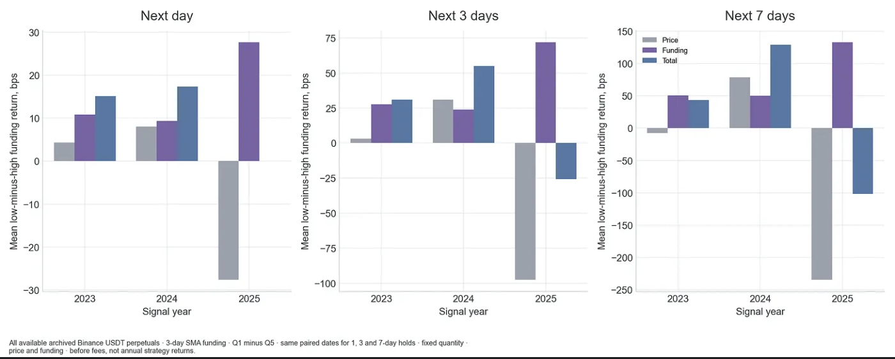

*图：之后 1 天 / 3 天 / 7 天。纵轴：低资金费率减高资金费率的平均收益（bps）；横轴：信号年份。灰 = 价格；紫 = 资金费；蓝 = 合计。注释：币安存档中所有可用的 USDT 永续合约 · 3 天资金费率简单平均 · Q1 减 Q5 · 三个持有期使用相同配对日期 · 固定数量持仓 · 未扣手续费，不是策略年度收益。*

3 天的收益差在 2023 年和 2024 年是正的，到 2025 年变成了负的。2025 年，更有利的资金费没能弥补价格变动带来的亏损。持有更长时间也没能挽救这一年。

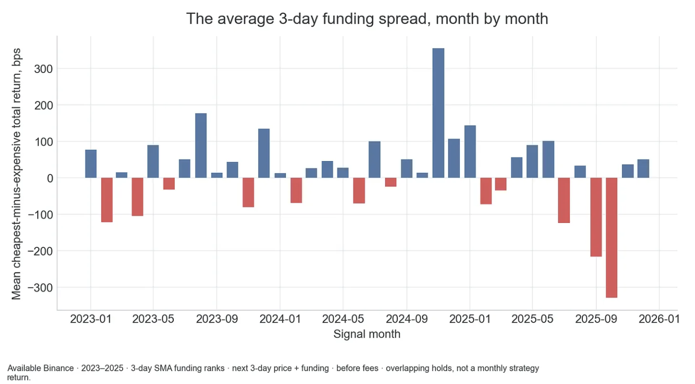

*图：每个月的 3 天资金费率收益差平均值。纵轴：最便宜减最贵的平均总收益（bps）；横轴：信号月份；蓝 = 正，红 = 负。注释：可用的币安数据 · 2023–2025 · 按 3 天资金费率简单平均排序 · 之后 3 天"价格 + 资金费" · 未扣手续费 · 持仓有重叠，不是策略月度收益。*

这里只有完整的三年。拆成月份能帮我看清平均值是从哪里来的，但它并不能给我更多年份的证据。

> **补充说明**
>
> | 3 天持有期（约，bps） | 价格 | 资金费 | 合计 |
> |---|---|---|---|
> | 2023 | +3 | +27 | +30 |
> | 2024 | +30 | +23 | +55 |
> | 2025 | -97 | +72 | -25 |
>
> - 2025 年资金费部分反而是三年里最大的，但价格部分亏得更多，直接把资金费收益吞了。持有 7 天时价格约 -235、合计约 -100。
> - 与第 10 节呼应：费率差距大往往意味着市场情绪分化严重，价格风险也更大。
> - 按月看：多数月份为正，但 2025 年下半年连续几根深红柱（最低约 -330 bps）。整体规律是"多数时候小赚，偶尔大亏"。
> - 36 个月本质上还是三年的行情，不能当成 36 份独立证据。

## 13. 最便宜组和最贵组的走势分别是什么样的？

前面的柱状图展示的是平均观测值。用累计曲线，更容易看懂整个过程。我先测试一个最直接的只做多问题：在能对应上的市值前 20、前 50、前 100，或者整个可对应范围里，买入资金费率最便宜的那五分之一。每天用 3 天资金费率平均值重新分组。

前 50 那张图展示了三条线：做多便宜组这一边、做空贵组这一边，以及两边各占一半的组合。紫色线就是简单的横截面资金费套利：做多和做空的金额相等。

这些示意图都是满仓、每组内部等权重、每天调仓，而且未扣成本。它们不是第二部分里那些有仓位上限的组合。

把两边拆开看，能回答一个有用的问题：做空这一边到底有没有帮上忙，还是我把一笔亏钱的空单，绑在了一笔还不错的多单上？

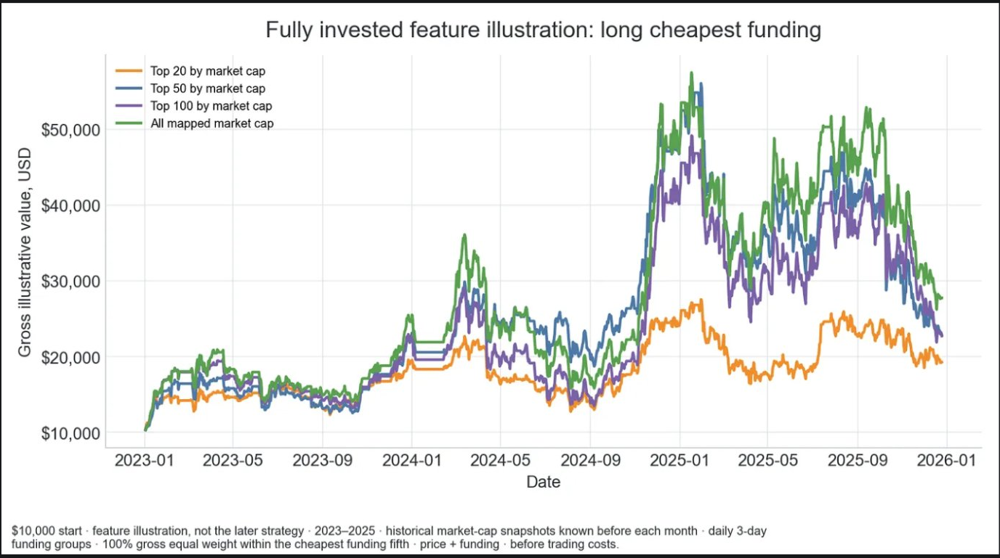

*图：满仓示意图：做多资金费率最便宜的币。纵轴：示意账户价值（未扣成本，美元）。橙 = 市值前 20；蓝 = 前 50；紫 = 前 100；绿 = 全部可对应的币。注释：初始 10,000 美元 · 仅为特征示意，不是后面的策略 · 使用每月之前已知的历史市值快照 · 每天按 3 天资金费率分组 · 在最便宜五分之一内 100% 等权 · 价格 + 资金费 · 未扣交易成本。*

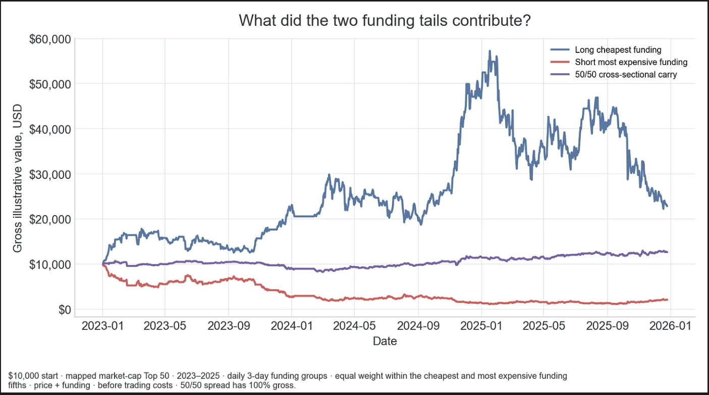

*图：资金费率两端各贡献了什么？蓝 = 做多最便宜；红 = 做空最贵；紫 = 50/50 横截面资金费套利。注释：初始 10,000 美元 · 可对应的市值前 50 · 每天按 3 天资金费率分组 · 两端五分之一内等权 · 价格 + 资金费 · 未扣交易成本 · 50/50 组合总仓位 100%。*

> **补充说明**
> - **只做多便宜组**：四条线从 1 万冲到 5 万多，又跌回 2 万–2.8 万。主要跟着大盘走（2024 年底牛市暴涨、2025 年下半年大跌），本质上还是在赌大盘。
> - **做多便宜组（蓝）**：1 万 → 约 2.3 万，但中间从约 5.7 万回撤到 2.3 万。
> - **做空贵组（红）**：1 万 → 约 2 千。这三年大盘大涨，单独做空任何一篮子币都会被碾压，资金费远远不够弥补。
> - **一半多一半空（紫）**：1 万 → 约 1.27 万，平稳很多。多空抵消大盘涨跌，剩下的主要是"便宜组比贵组表现好"的差值。三年约 +27%，扣成本前一年不到 10%。
> - 空头单独看是亏钱的，但它的作用是对冲大盘风险。这份"保险"值不值，要看扣成本后的结果。

## 14. 选币池之间的差别是从哪里来的？

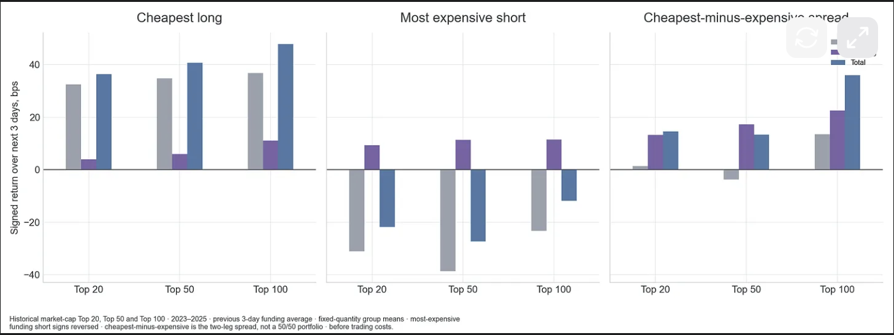

*图：做多最便宜组 / 做空最贵组 / 最便宜减最贵的收益差。纵轴：之后 3 天带正负号的收益（bps）；横轴：市值前 20 / 前 50 / 前 100。灰 = 价格；紫 = 资金费；蓝 = 合计。注释：前 3 天资金费率平均 · 固定数量持仓的组平均值 · 做空最贵组时正负号已反转 · 收益差是两边之差，不是 50/50 组合 · 未扣交易成本。*

这就是我把两边拆开看的原因：买入资金费率便宜的币和做空资金费率贵的币，吸引力并不一样。一笔还不错的多单，可能会被一笔亏钱的空单拖累。图表比较的是之后 3 天。

在市值前 20 里，资金费率最便宜的五分之一平均有 4.0 个币；在前 50 里平均有 10.0 个币。这是在市值选币池内部按资金费率分出的组，不是市值最小的那一组。

> **补充说明**
>
> | 之后 3 天（约，bps） | 做多便宜组 | 做空贵组 | 两边相加 |
> |---|---|---|---|
> | 前 20 | +36 | -22 | +14 |
> | 前 50 | +41 | -27 | +14 |
> | 前 100 | +48 | -12 | +36 |
>
> - 做多那边主要靠价格赚钱（这三年整体是牛市），资金费贡献不多。
> - 做空那边收到了资金费（约 +9 到 +11），但价格亏得更多（约 -23 到 -38）。
> - 空头把多头收益拖掉了一大半。

## 15. 最简单的多空规则，扣掉成本后还剩下什么？

在调整仓位大小之前，我先保留这个简单规则：把历史上市值前 50 的币按过去 3 天的资金费率排序，账户的一半做多最便宜的五分之一，另一半做空最贵的五分之一。每一边内部的币等权重。每天检查一次仓位。

我比较同一套仓位在扣交易成本前后的表现：成本按 10 bps 算，也就是每交易 10,000 美元付 10 美元。开仓、调整仓位和最后平仓都要算成本。这里没有按波动率调整仓位，没有缓冲区，也没有额外的平滑处理。只要能分出五个组，账户就一半做多、一半做空。

这个组合跑完了 2023–2025 年的每一天，分不出五个资金费率组的时候就持有现金：有 985 天在交易，110 天持有现金。如果持有的币缺失收益数据，测试就会停下来。费率相同的情况可能让某一组只剩很少几个币，所以持仓可能会很集中。时间范围更宽，也解释了为什么这里的扣成本前曲线和前面那张示意图不一样。

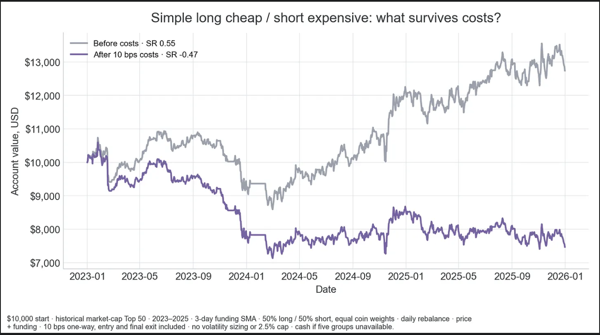

*图：简单的做多便宜 / 做空贵：扣掉成本后还剩什么？灰 = 扣成本前，夏普比率 0.55；紫 = 扣 10 bps 成本后，夏普比率 -0.47。注释：初始 10,000 美元 · 历史市值前 50 · 2023–2025 · 3 天资金费率简单平均 · 50% 做多 / 50% 做空，币等权 · 每天调仓 · 价格 + 资金费 · 单边 10 bps，含开仓和最后平仓 · 无波动率调仓、无 2.5% 上限 · 分不出五组时持有现金。*

这个简单规则在扣成本前把 10,000 美元变成了 12,740 美元，但扣成本后只剩 7,470 美元。扣成本前的夏普比率是 0.55，扣成本后是 -0.47。年换手率是 177.9 倍，扣成本后的最大回撤是 -32.7%。交易成本把收益吃光了。这里的夏普比率是拿平均收益和波动做比较，最大回撤是从最高点到最低点的最大跌幅。

> **补充说明：算一笔账**
> - **年换手率 177.9 倍**：一年里累计买卖的金额是本金的 177.9 倍。原因是每天按最新排名换仓。
> - **成本**：177.9 × 0.1% ≈ 每年约 17.8%。
> - **扣成本前**：三年 1 万 → 1.274 万，约每年 +8.4%。
> - **结果**：8.4% 的收益付 17.8% 的成本，扣成本后约每年 -9%，三年剩 7,470 美元。
> - 信号本身是有的（扣成本前夏普 0.55），但太弱、换仓太频繁，赚的不够付手续费。10 bps 是比较现实的散户成本；如果能拿到做市商级别的低费率或返佣，结论可能不同。

## 16. 我从中得到的结论

在这个样本里，资金费率包含一个有意思的规律。资金费率便宜的币，平均总收益比资金费率贵的币好，但价格变动拿回去了一部分资金费上的优势。结果也会随着年份和币的市值大小而变化。

有用的经验法则是：

- 既要算资金费，也要算价格变动。收到钱不等于赚到钱。
- 对之后几天来说，最近的资金费率看起来比长期平均值更有用。
- 把多头和空头两边分开检查。两边的贡献并不一样。

最简单的每日多空规则，扣掉成本以后是亏钱的。

在第二部分，问题很实际：能不能靠减少交易，留下足够多的收益？我先用同样的规则，改变检查仓位的频率，然后再试不同的仓位大小。

## 17. 讨论或交流

我是一个自学的系统化交易者。我会犯错，也会改正。如果你发现了错误，或者有更好的测试方法，可以在 X 上给我发消息：@dima_quant。

我会发布研究成果，以及我正在搭建的策略的进展。订阅以获取下一篇研究。

这是研究，不是投资建议。

---

## 18. 附：全文要点回顾（译者）

1. **信号是真的**：资金费率有持续性（今天高、明天大概率也高），便宜组跑赢贵组，去掉极端值后依然成立。
2. **但被价格吃掉一半**：资金费便宜的币往往价格偏弱，贵的币往往价格偏强，两者相互抵消。
3. **很不稳定**：2025 年整体为负，不同市值组每年表现忽高忽低；资金费率差距大并不带来更高收益。
4. **值得研究的组合**：费率便宜 + 近期价格强势，效果最好（未扣成本、未做完整检验）。
5. **空头是拖累**：做空贵组在大牛市里单独看是亏的，主要起对冲大盘的作用。
6. **成本是致命问题**：每天换仓导致年换手近 178 倍，10 bps 成本一年约 17.8%，远超扣成本前约 8% 的年化收益。

第二部分的方向：少换仓、降低成本，再看仓位大小怎么调。
